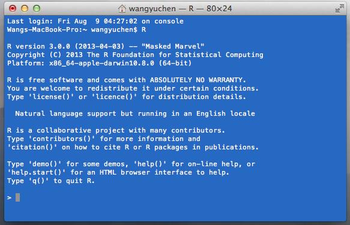

R 与 RStudio Server 简介
===

1. R 与 RStudio IDE 的关系
---

### 什么是 R
> R 是一种免费的用于统计计算和作图的编程语言和软件环境。

这个经典的 R 的定义来自 wikipedia, [1] 该定义中的各个名词都常被人拿来指代 R：有人称其为“软件”，有人称其为“语言”，也有人称其为“环境”。[2] 在这里，我们仅仅从计算机上的一个应用程序的角度来解释什么是 R。

#### R 是一种解释型语言
任何一种语言写出的程序都需要被翻译为机器语言才能被计算机理解并执行，而翻译的方式则分为解释和编译两种。编译型语言写出的程序需要经过编译的过程将代码编译为可执行文件，然后机器即可运行该可执行文件来完成指令。所以编译型语言翻译为机器语言的过程和其执行的过程是异步的。而解释型语言并不需要编译的过程，其代码直接可以被翻译和执行，其翻译和执行是同步的。

显然对于编译型语言来说，编译的过程决定了代码被如何转化为机器语言，这个过程由该语言的编译器来完成。而对于解释型语言，决定代码如何被翻译的应用程序叫做命令解释器。命令解释器是一个计算机程序，其接受某种语言写就的代码为输入，将其按语言的定义翻译为机器语言后传递给机器执行。R 语言，作为一个应用程序来说，其核心就是这个懂得如何将 R 语言的命令解释给机器执行的命令解释器。

#### R 的解释器
那 R 的解释器究竟是一个怎样的程序？是不是点开安装好的 R 图标后打开的就是了？其实并不完全是，这当中还有些小小的区别。R 的解释器是命令行界面（CLI）的，也就是说其输入的代码和输出的提示、警告等都只能是纯文本命令。你点击图标所打开的是其官方默认为其配置的图形界面程序（GUI），该程序除了“引用”了解释器到它主要的窗口中外，还实现了编辑器，图形展示和快捷按钮等功能。一般来说，对于在同一个窗口中提供这些相关功能的 GUI 应用程序，往往被称作集成开发环境（IDE）。

既然 R 语言的核心在于其解释器，那能否绕开 GUI，直接打开 R 的解释器呢？之前已经知道 R 的解释器是命令行界面的，想打开一个 CLI 程序则需要一个终端--所有 CLI 应用程序的“桌面”。

上图显示，在我的 OS X 上安装了 R 后，我在终端中键入 `R` 便可以打开 R 的解释器， 输入的 `R` 是其快捷方式的名称。在这个 CLI 下可以像在任何 GUI 下一样输入 R 语言的命令，这说明了 R 的 GUI 并不是必须的。

#### R 的图形界面
若想更方便的使用 R，把一些常用的命令制作成快捷键是很自然的想法。于是就有了 R 的 GUI。GUI 仅仅是对于 R 的命令提供包装和图形化而已，其本质还是将命令传递给 R 的解释器并执行。一个 GUI 程序，只需提供对 R 语言常用功能的图形化包装即可被称 R 的 GUI，如果包括了解释器、编辑器和图形展示等功能则可被称为 IDE，可见 R 的 GUI （IDE） 并不唯一。

### RStudio 和 R
RStudio 就是一个优秀的 R IDE。其窗口通常被分为四部分，分别提供了解释器、编辑器、工作空间等功能。其窗口一般的样子如下图：

RStudio 基本上能够完全替代 R 官方开发的 GUI，并在这之外还有许多优秀的功能，我们将会在之后的章节一一介绍。

[1] R (programming language) [http://en.wikipedia.org/wiki/R_(programming_language)](http://en.wikipedia.org/wiki/R_%28programming_language%29)

[2] lijian 的博客，R语言辨 [http://jliblog.com/archives/8](http://jliblog.com/archives/8)

---

2. RStudio Server 是什么
---

在序言中已经提及，本手册中介绍的 RStudio 都指的是运行在一台远程 Linux 服务器上的 RStudio Server。那么 RStudio Server 究竟是什么？

### RStudio Desktop 与 RStudio Server 有什么区别？
RStudio Desktop 是一个 R IDE，与您已安装在您的本地 Windows，Mac OS X 或 Linux 工作站上的 R 配合工作。RStudio 桌面版是一个**独立的**桌面应用程序，不需要以任何方式连接到 RStudio 服务器版。

RStudio Server 是一个 Linux 服务器上的应用程序，提供了在服务器上运行的 R 环境，而用户通过浏览器来访问。

### 使用 RStudio Server 的好处
在管理员完成服务器端的配置后，用户可以在网页浏览器中使用 R 和 RStudio。在远程服务器上部署 R 和 RStudio 的好处如下：

* 在任何地方，从任何设备（能够浏览互联网的设备，即使是智能手机、平板电脑） 来访问你的 R 工作空间。
* 以非常简单的方式和同事或同学共享代码、数据和其他文件。
* 使得多用户可以共享服务器上强大的计算资源。
* 对管理员来说，中心化的配置和管理 R 、TeX 和各种依赖包，使用户拥有一个统一的开发环境。

RStudio Server 可以运行在各大发行版的 Linux 服务器上，也可以从源代码编译安装。用户使用符合一定标准的浏览器、并拥有管理员发放的账号和密码即可使用。用户享有独立的存储空间和工作环境，并可以通过 RStudio 自由地使用系统的其他资源。

